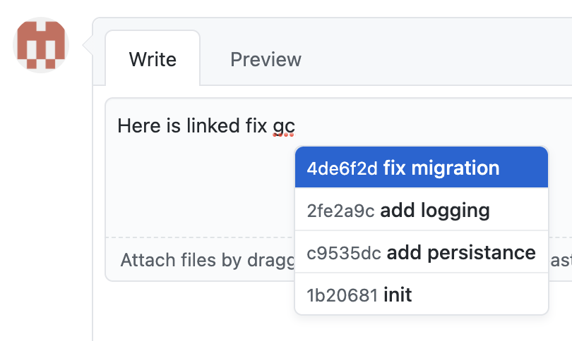

# Github Pull Request Commits

Suggest Pull Request commits white typing

## Usage

1. Create Github Personal access token:
   - Go to: `Settings` > `Developer Settings` > `Personal access tokens`
   - Click `Generate new token`
   - Check `repo` scope
   - Click `Generate token`
2. Add Personal access token to extension options:
   - Click on extension bagde > `Options`
   - Add Personal access token
   - Click `Save`

## License

**[MIT](LICENSE)** Licensed
